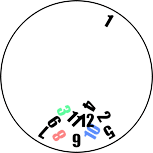

  

  <a target="_blank" href='https://www.facebook.com/TimeOff-325473081302189'>facebook</a> |
  <a target="_blank" href='https://twitter.com/TimeOff72858529'>twitter</a>

**Note: To use this project with built in user interface then use its client side implementation which could be found [here](https://github.com/zafar-saleem/timeoff-app)

TimeOff is an application that allows companies and organisations to allow their employees to set vacations before they take their time off. TimeOff is an easy to use vacation setter with just few clicks.

TimeOff is completely open source meaning companies can use this project and set it up either internally or in the cloud for their use.

In addition, it is completely customizable i.e. companies can customize its user interface as well as can add new features or remove for their use both
on client and serverside.

### Set up is as easy as it can be
Setting up of this project is simply `clone it`, `npm install` for dependency installation and deploy.

### Architecture
Very simple and easy to scale architecture. All it needs is implementation of new services for new features and you are good to go.

## Technology stack
The technology stack used is below
* Node.js
* Express.js
* MongoDB
* Passport

## Client side of this project
The client side of this project could be found [here](https://github.com/zafar-saleem/timeoff-app)

## Usage
To run this project locally, use `nodemon` package. Run `nodemon index.js` in timeoff-server folder which will run its server. Then use the client side and run its server using `npm start` command and visit the url mentioned in terminal of the client side.

## Database
This project requires setting up your own database on your machine. Please follow below links.
* [Windows](https://docs.mongodb.com/v3.2/tutorial/install-mongodb-on-windows/)
* [MacOS](https://www.code2bits.com/how-to-install-mongodb-on-macos-using-homebrew/) Make sure that homebrew is already installed on your machine.

Once you have that setup, make one admin account in Users collection, with properties username, password, email and role(which should be set to admin).

To create an admin user, go to `http://localhost:PORTNUMBER/register` and enter admin's details. Click register. Then go to mongodb CLI. use timoff database and use below query to update user's role to Admin.

`db.users.update({"username": "root"}, {$set:{"role":"Admin"}})`

# Contributions
In order to contribute, please open issues and make pull requests.

# Contact
timeoff.sendmail@gmail.com
